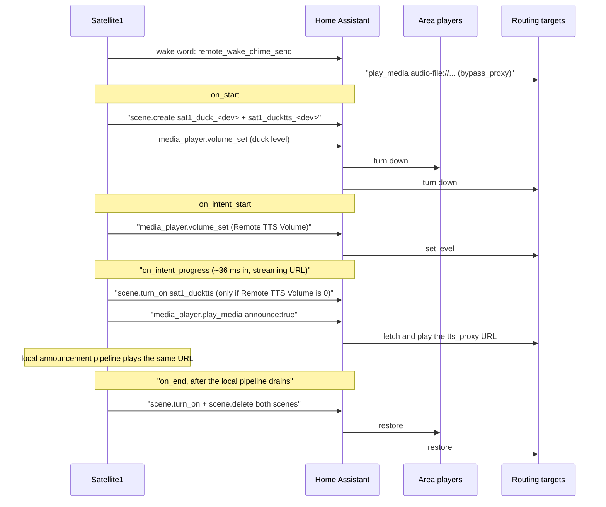

# TTS Routing and Area Ducking

Routing a Satellite1's voice responses to other speakers, and turning down the speakers in the
same room while you talk to it.

> [!NOTE]
> **This file is temporary.** It exists so the commit that introduced these features can be
> reviewed with its reasoning attached. The customer-facing half of it will move to
> [docs.futureproofhomes.net](https://docs.futureproofhomes.net) and this file will be removed.

> [!WARNING]
> **Breaking change: this release moves the configuration into the device's web app.** The move the
> note above promised has happened, and it renames two entities and deletes three. Nothing migrates
> automatically. See [Upgrading](#upgrading) before you flash.

## Contents

- [Upgrading](#upgrading)
- [The three layers](#the-three-layers)
- [Setup](#setup)
- [Entities](#entities)
- [How a routed interaction runs](#how-a-routed-interaction-runs)
- [Design decisions](#design-decisions)
- [Rejected alternatives](#rejected-alternatives)
- [Known limits](#known-limits)
- [Troubleshooting](#troubleshooting)

## Upgrading

**Which speakers to route to, and which to duck, now live in the device's own web app** rather than in
Home Assistant. Open the device's IP in a browser and go to **Config**. The reason is a hard limit
rather than a preference: the target list was an ESPHome `text` entity, those cap at 255 characters
because the restore saver writes the length in a single byte, and one area's worth of players needs
roughly twice that. A 292-character write returned HTTP 200 and was silently discarded.

**Your existing target list is not migrated.** It was stored in an entity that no longer exists, and
the new selection is a different shape — whole areas plus individual players plus carve-outs, rather
than one flat list. Write down your target list before flashing, then re-pick it in the app. In most
cases that is one click, because "everything in this room" is now a single tick.

### Renamed

Both keep their settings, but the `entity_id` changes, which breaks any automation, script, dashboard
card or history that referenced the old one. Fix those references, or rename the entity back in Home
Assistant under Settings > Devices & services > ESPHome > your device.

| Was | Is now |
| --- | --- |
| `Remote TTS Routing` | `Route TTS To All Area Players` |
| `Duck Area Players` | `Duck All Area Players` |

Both also stop being independent switches and become views of the app's selection. If an automation
turns one on, it now selects this device's whole area; if it reads one, it is asking "is my whole area
selected". `Duck Area Volume` was not renamed — it already had that name.

### Deleted

| Entity | What replaced it |
| --- | --- |
| `Remote TTS Targets` | The tree in the app's Config route. |
| `Remote TTS Mutes Local Voice` | The **Local Speaker** row at the top of that tree, ticked by default — the same default as this switch being off. |
| `Duck TTS Targets` | Nothing. Routing targets are now always ducked. |

Any automation referencing one of these will fail after flashing.

### Also retired

The **`Satellite1 Do Not Duck`** label no longer does anything. Untick the player in the app's ducking
tree instead. The label can be deleted. This is the one place the change costs you something: see
[Exempting a player](#exempting-a-player).

### New capabilities

Worth knowing, because they were not possible before: ducking can now reach **any room**, not just the
device's own; a whole area can be selected such that speakers added to it later are included
automatically; and players Home Assistant has put in **no area** — which on a typical install is most
of them — are offered by name in a "No Area Assigned" group rather than having to be typed as entity
ids.

## The three layers

| Layer | File | Owns |
| --- | --- | --- |
| Gain reconciler | [`config/common/voice_assistant.yaml`](../config/common/voice_assistant.yaml), [`dac_proxy.cpp`](../esphome/components/satellite1/audio_dac/dac_proxy.cpp) | This device's own output level: DAC volume and the per-channel ducking that goes with it. |
| Routing | [`config/common/tts_routing.yaml`](../config/common/tts_routing.yaml) | Sending the response to remote `media_player` entities, and everything that has to be true first. |
| Area ducking | [`config/common/area_ducking.yaml`](../config/common/area_ducking.yaml) | Other speakers' volumes: turning the room down, setting the targets' level, and putting both back. |

They are one feature set rather than three. **Remote TTS Volume** is declared in `tts_routing.yaml`
but carried out in `area_ducking.yaml`, because setting a remote speaker's volume needs the same
snapshot-and-restore machinery ducking already had. And **Voice Override** decides both this
device's own speech level and whether some *other* Satellite1 routing to it may set its volume.

### The gain reconciler

Everything that used to call `mixer_speaker.apply_ducking` directly — `media_player.yaml`,
`timer.yaml`, `voice_assistant.yaml` — now calls one script, `audio_gain_reconcile`. It is a pure
function of the current state, so any trigger can run it at any time and converge on the same
answer. Nothing latches; anything that changes the answer just calls it again.

It exists because the mixer has no per-pipeline gain: a source speaker's `set_volume` forwards
straight to the shared output speaker. The only way to make voice louder than music is to raise the
DAC and duck each channel back down to the level it should have had.

```
ref              = max(media_volume, voice_volume)      # voice_volume falls back to media at override 0
dac_target       = 0.1 + ref * 0.9                      # the media player's own volume remap
media_duck_db    = db_per_unit * (ref - media_volume)   # + 20 dB while anything is speaking
announce_duck_db = db_per_unit * (ref - announce_ref)   # announce_ref is voice_volume for speech
db_per_unit      = dac.volume_span_db() * 0.9           # 35 dB on the TAS2780, 52.5 dB on the PCM5122
```

The cost of holding the DAC at `ref` unconditionally is that while an override is set, the media
channel carries the difference as ducking whether or not anything is speaking — 8 dB at override
0.80 against media 0.55 — and the mixer ducks in Q15 on 16-bit samples, so that is real dynamic
range spent on music. It is paid deliberately: an announcement this device did not initiate arrives
with no warning, and holding the DAC there is what lets it start at the right level on its first
sample.

## Setup

Two things live in Home Assistant and cannot be configured or detected from the device.

**Allow the device to perform Home Assistant actions.** Both features work by asking Home Assistant
to do something, and it refuses until told to trust the device. It leaves that off for every newly
added device (`DEFAULT_NEW_CONFIG_ALLOW_ALLOW_SERVICE_CALLS` is `False` in ESPHome's config flow):

> Settings > Devices & services > **ESPHome** > your Satellite1 > **CONFIGURE** > tick
> **"Allow the device to perform Home Assistant actions"** > **Submit**

With it unticked, `async_on_service_call` logs an error, raises a repair issue and returns without
answering, so nothing on the device hears a rejection. Ticking it goes through an
`OptionsFlowWithReload`, which reconnects the device, so every check re-runs within seconds and
nothing needs reflashing.

**An area, for the two "all area players" switches.** Those two switches mean "my own room", and a
device in no area has no room to refer to, so both read off and refuse to turn on. Everything else
still works: from the web app you can route to and duck any room in the house, named or not.

> Settings > Devices & services > **ESPHome** > your Satellite1 > pencil icon > **Area** > **Update**

## Entities

### Routing

**Which speakers** is configured in the device's own web app, not in Home Assistant. Open the device
in a browser and use the **Config** route. Home Assistant keeps one switch for the common case.

| Entity | Purpose |
| --- | --- |
| **Route TTS To All Area Players** | Switch. On sends the response to every media player in this device's area. A projection of the selection, not a value of its own — see below. |
| **Remote TTS Volume** | The level the response should arrive at on the targets. `0` leaves every target's volume alone. |
| **Remote Wake Chime** | Switch, off by default. Satellite1 targets sound their own wake chime when this device hears the wake word. |
| **Voice Override** | This device's own level for speech, local or received. `0` follows the media volume. |
| **Remote TTS Status** | Diagnostic. Everything that has to be true before a response reaches a remote speaker, in one line. |

**The switch is a view of the selection, not a separate setting.** It reads on when this device's own
area is selected whole with nothing carved out of it. Turning it on selects that area; turning it off
deselects it. Untick one speaker in that room in the web app and the switch reads off — correctly,
because that is no longer the whole area. Pick a speaker in a *different* room and the response routes
there with this switch off, which the old master switch had no way to express.

There is therefore no state in which routing is "enabled" with nothing to route to. Anything chosen
means the answer is going somewhere; nothing chosen means it plays here.

**Where the response plays locally** is the **Local Speaker** row at the top of the app's list, ticked
by default. It replaced a switch called `Remote TTS Mutes Local Voice`, which said the same thing
backwards.

**Music Assistant duplicates are filtered out for you.** A speaker MA has adopted has two
`media_player` entities and both accept an announcement, so either appears to work. With MA ids,
playback is serialized across the targets and Sonos starts seconds late and clips the first syllable.
With native ids everything starts together and Sonos plays the response whole. The app does not offer
MA entities and whole-area expansion rejects them, so this is now hard to get wrong; the device still
checks and says so if one arrives another way. See [Rejected alternatives](#rejected-alternatives).

### Ducking

Which speakers get ducked is chosen in the web app's **Config** route, the same way routing targets
are, and using the same tree. Home Assistant keeps the volume and one switch.

| Entity | Purpose |
| --- | --- |
| **Duck All Area Players** | Switch. On ducks every media player in this device's area. A projection of the ducking selection, exactly as its routing counterpart is — same on/off rules. |
| **Duck Area Volume** | The level ducked players are set to, default `20%`. |

**Duck Area Volume** is a target, not a reduction: every player is set to that level, so the room
lands somewhere predictable however loud it started. Players already quieter are left alone. It is
Home Assistant's `volume_level`, a 0-1 fraction each integration reads however it likes, so `20%`
is not a fixed amount of attenuation and is unrelated to the decibel ducking above.

`0%` is literal for the room — a media player at volume `0` is a muted one on many integrations,
every ESPHome speaker included, and that is the right answer for a speaker not about to speak. The
The routing targets are floored at `1%` instead; see [Design decisions](#design-decisions).

**What gets ducked:** everything you have chosen in the app that is not obviously silent, reports a
volume, and is currently louder than the duck level — minus this device, and minus Music Assistant
entities.

Two things are gone from that list. **Ducking is no longer confined to this device's area**: the tree
offers every room in the house, so a Satellite1 in the hallway can quieten the living room. And the
routing targets are ducked unconditionally; the **Duck TTS Targets** switch that used to gate them is
deleted. That switch existed because ducking a target was only safe when the response arrived at a
level not derived from the target's standing volume, and the peer Voice Override handling below is what
closed the unsafe case.

"Not obviously silent" rather than "playing" because `playing` is what a player reports when it
*owns* the audio, and an amplifier does not. A Denon or Marantz receiver reports plain `on` for
every input that is not one of its own network sources, so an AVR carrying the room over HDMI never
once says `playing` while it is the loudest thing in it. The cost is that a powered-but-silent
speaker gets a volume change it did not need, and the same level back afterwards.

### Exempting a player

The one case no state test can recognise is a `media_player` that is really an amplifier: ducking an
AVR turns down everything downstream of it, so a Sonos on one of its inputs goes quiet even though
nothing touched the Sonos. Untick that player in the app's ducking tree. It stays unticked when the
rest of its area is selected whole, and a speaker added to that room later is still picked up.

**This replaced a `Satellite1 Do Not Duck` label**, which was matched by label id and could be put on
an entity, a device or an area. The label was one setting for a whole fleet; unticking is one setting
per device. On an install with several Satellite1s that means visiting each one, and doing it again
after a factory reset. The trade was made deliberately — one source of truth for the selection, and the
web app is it — but if you have many devices and one problem amplifier, this is the part that costs
you. If you were using the label, it now does nothing and can be deleted.

## How a routed interaction runs



The order in that diagram is load-bearing in two places.

**The response is sent at `on_intent_progress`, not `on_tts_end`.** Home Assistant mints the
`tts_proxy` token before the speech exists and sends it as `tts_start_streaming`; device logs put
roughly 36 ms from intent start to that event and roughly 1.1 s to `on_tts_end`. `on_tts_end`
remains the fallback and is the only path on a TTS engine that does not stream. A global,
`tts_remote_sent`, makes the two triggers into exactly one call, and it is cleared at `on_start` so
each turn of a continued conversation gets a fresh one.

**Handing the targets their volumes back has to reach Home Assistant before the call that plays the
response.** ESPHome runs same-trigger automations in package merge order, and a package cannot
influence where it sits in that order from inside itself, so
[`config/satellite1.base.yaml`](../config/satellite1.base.yaml) declares a tiny inline package
listed ahead of `tts_routing` purely to bind `area_duck_release_tts_targets` first. It binds both
`on_intent_progress` and `on_tts_end`, since either can be the trigger that sends the response, and
the script is self-gated so being called twice hands the volumes back once.

### When the targets come back

Decided by **Remote TTS Volume**, read once at the start of the interaction so that moving the
slider midway cannot strand a volume:

- **`0`** — restored the moment the response is ready, just before the calls that play it. Nothing
  wants them held at a level of ours.
- **above `0`** — the level they are sitting at *is* the level the response is meant to arrive at,
  so they are held through it and restored once playback has finished.

Since remote playback reports no completion, "finished" means this device's own announcement
pipeline draining: it received the same URL and drains on roughly the same schedule.

### Continued conversations

When a response ends in a question, Home Assistant keeps the conversation going and each turn is a
whole new pipeline run. The room's snapshot is not retaken and its volumes are not handed back
between turns, so the room does not jump back to full volume in the gap where you are answering.

The mechanism is `area_duck_release`'s two waits. The first waits for the announcement to drain;
the second waits up to 5 s for the assistant to leave `is_running()`, which is `state != IDLE`. A
continued conversation never passes through `IDLE`, so still running once both waits are done means
another turn is starting, and the right thing to do is nothing at all.

This was a real bug before those waits moved here: the component's trigger for a continued turn is
the media player leaving `ANNOUNCING` — the very transition the first wait ends on — so the un-duck
and the next turn came off one event and the next turn lost, hit `area_duck_start`'s re-entrancy
guard, and every turn after the first played at full volume.

The routing targets are the one thing that does move on every turn, because
`tts_targets_volume_apply` lifts them for each response and nothing else brings them down.

### Backstops

| Backstop | Covers |
| --- | --- |
| `area_duck_watchdog`, 3 min | A pipeline that never reaches `on_end` or `on_error`. Sets `area_duck_force_release` so the release cannot defer again. |
| `area_duck_recover`, on reconnect | A device that rebooted mid-duck. The scenes live in Home Assistant, so they outlive the reset. |
| `tts_announce_watchdog` | An action call Home Assistant never answered. Waits for the local drain plus 15 s, then logs and flashes the ring. |

## Design decisions

**Home Assistant holds the volume snapshot, in a scene.** `media_player.volume_set` takes one
volume for every target, so restoring — where each player needs its own level back — has no
single-call form. A scene's `entities` dict is per-entity and Jinja can build it. Two scenes, not
one: `scene.sat1_duck_<device>` for the room and `scene.sat1_ducktts_<device>` for the targets,
because `scene.turn_on` applies a whole scene and the two halves are released at different moments.

**The stored state in those scenes is `'unknown'`, on purpose.** Scene entries must carry a state
string, and a truthful one is destructive on the way back: `media_player/reproduce_state.py`
replays `turn_on` for `playing`, `paused`, `idle`, `on` and `buffering`, then `media_play`,
`media_pause` or `media_stop` to match. `'unknown'` falls through every one of those and lands only
on the `volume_level` branch, so restoring the scene issues nothing but `media_player.volume_set`.
Storing what the players were really doing would restart their queues.

**The targets' scene is the union of both features that write to a target's volume**, taken once,
up front, before anything is touched. A second `scene.create` taken later would record a level this
firmware had just written and restore the room to that.

**The device's identity travels in the payload, as a MAC.** Home Assistant renders these templates
in `async_on_service_call` with nothing but the variables the device sent, so there is no implicit
"calling device" in scope. The MAC is the handle that survives a rename: ESPHome's `manager.py`
registers the device with `connections={(CONNECTION_NETWORK_MAC, mac)}`, which the registry
normalizes to lowercase with colons.

**Remote TTS Volume is asked for twice, because asking once was not enough.** It travels inside the
announcement as `extra.volume`, which is the polite form — the level applies to the response and
the speaker's standing volume is never touched. In testing only Sonos read it. So above `0` the
device also snapshots the targets that read no per-call level, issues an ordinary
`media_player.volume_set`, and hands the old level back afterwards. Two kinds of target are left
out: **Sonos**, which already read the level, and **a Satellite1 whose own Voice Override is above
`0`**, which has a level of its own to apply. A Satellite1 at Voice Override `0` is *not* skipped —
`0` means "no override" and speech follows the media volume there, so it has no level to fall back
on.

That volume is set at `on_intent_start`, one trigger earlier than the response, and the response is
held back a further 250 ms whenever the slider is set. Ordering is not the worry — Home Assistant
dispatches calls in the order the connection delivers them — but dispatch is not application: a
networked speaker takes a round trip to accept a volume, and a response that starts at the old
level and jumps partway through is exactly what this prevents. That gap used to be the whole of TTS
generation, back when the response was sent at `on_tts_end`; it is 36 ms now.

**A Satellite1 target sets its own level.** No per-call volume can reach the firmware, so
`audio_gain_reconcile` plays any HTTP announcement at that device's **Voice Override** instead of
its media volume — a `tts.speak`, a doorbell clip sent with `announce: true`, or a response another
Satellite1 routed here. Chimes are excluded, because they arrive as `audio-file://` URIs through a
different media source, so raising Voice Override cannot make the wake sound startling. The
cleanest way to make a routed response louder on a Satellite1 is therefore to set the slider on the
*target*.

**Targets are floored at `1%` when ducked, whatever Duck Area Volume says.** `volume_level` `0`
does not mean "very quiet" to a media player, it means mute, and on several integrations it means
mute in hardware — ESPHome's `SpeakerSourceMediaPlayer::set_volume_()` ends in
`set_mute_state_(true)` under 0.001, which reaches `DACProxy::set_mute_on()`, which writes it to
flash. A muted target cannot play the response at any level, Voice Override included, so a `0%`
duck used to take the answer with it. `1%` still puts roughly 35 dB between the music and the
answer on a Satellite1 target.

**Music Assistant entities are excluded from the area walk so every speaker is ducked exactly
once.** A speaker MA has adopted appears in the area twice, and ducking both means ducking the same
speaker twice — which was worse than untidy, because sparing works on entity ids: a target
deliberately spared was turned down through its mirror anyway. It could also turn down the
Satellite1's own speaker, the one about to deliver the response. The native entity is kept, since
it is the id the original integration owns and the one the target list is documented to hold.

**Routing switches the announcement codec to MP3, and back to FLAC when off.** Sonos plays an
announcement as an AudioClip over its websocket API, and that accepts MP3 and WAV only
(`ANNOUNCE_AUDIOCLIP_SUPPORTED_FORMATS`). Hand it a FLAC URL and the clip is submitted anyway, the
speaker answers success, and no sound comes out — no error reaches Home Assistant, let alone the
device. The codec is the device's to pick: Home Assistant reads the announcement format off
`ListEntities` and passes it to the TTS engine as `ATTR_PREFERRED_FORMAT`, so it decides the
extension on the one URL every target is given. FLAC is the cheaper decode and stays the default
for a device playing its own responses; MP3 is only paid for while a response is on its way
elsewhere.

`ListEntities` is sent once per connection, so a format changed at runtime is invisible until the
next one. The device asks for that reconnect with `homeassistant.reload_config_entry` — the same
thing ticking the actions checkbox does — which costs a few seconds of unavailability. It is only
asked for when the codec actually changes, and a device that boots with routing already configured
never reloads at all, because `tts_announce_format_apply` runs at `on_boot` priority `-100` before
anything connects.

**The device probes the actions checkbox rather than waiting to be noticed.** `ha_action_probe`
fires one harmless `persistent_notification.dismiss` for an id nothing ever creates, five seconds
after Home Assistant connects, and reads the answer off whether one comes back at all — with the
box unticked, neither `on_success` nor `on_error` fires, and that silence is the entire signal
available. Firing the call is also what surfaces the problem *inside* Home Assistant, since the
repair issue it raises for a rejected call already carries the fix. Gated on routing being on, so a
device that never uses the feature never trips that card.

Home Assistant has only answered action calls since **2025.12**. Before that an allowed call and a
rejected one are identical from the device, so the check is skipped rather than guessed:
`ha_supports_action_replies` is parsed out of the client info string on connect, and
`ha_actions_allowed` lands on `3` (unverifiable) instead of `2` (blocked). The same flag arms
`tts_announce_watchdog`, which would otherwise flash red after every response on an older install.

**The remote wake chime sends a URI, not audio.** `audio-file://wake_word_triggered_sound` is
resolved by the target against its own flash: `async_process_play_media_url` returns early for any
scheme that is not http or https, and on the far side `SpeakerSourceMediaPlayer::control()` picks
its source by asking each one `can_handle()`, which `AudioFileMediaSource` answers for that scheme.
So a few dozen bytes cross the network, the target plays the same file at the same level its own
wake word would have, and **targets need no firmware update and gain no new entity** — only the
device making the call is reflashed.

`bypass_proxy: true` is not decoration. Home Assistant substitutes an ffmpeg proxy URL for any
media id its `_is_url()` accepts on any device advertising supported formats, and `_is_url` is no
more than "urlparse found a scheme and a netloc", which this URI satisfies. ffmpeg cannot open it,
so without the flag the call succeeds, the log stays clean, and no chime is ever heard.

Three things decide whether a target chimes, all checked per target per wake word: it has to be a
Satellite1, its own **Wake sound** switch has to be on, and routing has to be configured. A target
whose switch cannot be found is treated as off — the opposite default to the Voice Override lookup,
and the right way round here, because a chime nobody asked for is worse than one that never came.
This device's own **Wake sound** is not one of the three; it governs this device's speaker alone.

**A Satellite1 is recognised by manufacturer, not integration.** Every ESPHome device shares the
`esphome` integration, so `integration_entities` cannot separate them. Home Assistant derives the
registry's manufacturer and model by splitting the ESPHome project name on the first `.`, and this
project is `FutureProofHomes.Satellite1`.

**`DACProxy` gained a volume floor.** Two independent writers reach the component on every media
volume change, in an order neither controls: the speaker chain defers its I2C work to
`I2SAudioSpeaker::loop()`, while the media player's `on_volume` automation runs before that loop
iteration. Whichever wrote last used to win, so the reconciler's raise was silently overwritten.
Splitting the roles makes the order irrelevant: `set_volume()` records what the media player asked
for, `set_volume_floor()` records what the reconciler needs, and the DAC is driven from the greater
of the two. That is not an arbitrary tie-break — both are the same remap of a volume onto the DAC's
range, applied to `media_vol` and to `max(media_vol, voice_vol)`, so the floor is by construction
never lower.

Only the requested volume is persisted. The floor is a pure function of the media volume and the
Voice Override and is re-derived on boot; persisting a raised level would restore it with none of
the ducking that made it safe.

**Raising the DAC is deferred 800 ms; lowering is immediate.** Lowering just plays already-buffered
audio a little quieter than intended. Raising has to wait for the ducking to reach the samples
already in flight, and `i2s_audio_speaker` defaults to `buffer_duration: 500ms` on top of the
mixer's 100 ms. The delay lives in its own script, `audio_gain_raise`, so a burst of volume events
re-arms it instead of discarding a raise the reconciler already committed to — and it is skipped
entirely when the media channel is stopped with an empty buffer, since there is nothing to protect
and an announcement this device did not start would otherwise play its first 800 ms at the old
level and jump.

## Rejected alternatives

**A three-option routing dropdown, with a "TTS Synced" mode.** It built a Music Assistant group and
played the response through it as ordinary media so it travelled MA's sample-synchronized stream.
Measured against the announcement path it lost on every count: a noticeable delay before the first
word while MA established clock sync, music that never resumed because the response took over the
queue, a requirement for Music Assistant entity ids, and a standing volume change on every target
the firmware had no way to undo. Sample-accurate speech across a group is not worth any of those,
so the mode is gone and routing is a plain on/off choice per speaker.

> [!IMPORTANT]
> The target field has been through two moves. It was `text.<device>_tts_target_media_player`, then
> `text.<device>_remote_tts_targets`, and it is now not an entity at all — see
> [Upgrading](#upgrading). Home Assistant derives an ESPHome entity's id from its name, so each move
> orphaned the previous entity rather than renaming it in place.

**Two calls, split by integration.** The response used to go out as one
`media_player.play_media` for native entities and one `music_assistant.play_announcement` for MA
ones, on the belief that an MA entity could only be reached through the latter. That was wrong: MA
registers `play_announcement` against `_async_handle_play_announcement`, and its `async_play_media`
calls that same method whenever `announce` is true, reading `use_pre_announce`, `pre_announce_url`
and `announce_volume` out of `extra`. The two actions are one code path under two names. Testing
agreed — holding the entity ids fixed and changing only the action changed nothing, while holding
the action fixed and changing the ids fixed everything. The ids were the variable; the action never
was. It is one call now.

**Sending `announce_volume` to anybody.** Keeping that key away from Squeezebox targets was the
two-call split's last justification: native Squeezebox reads it as a `0.0`-`1.0` float and rejects
the call outright above `1`, so every level above 1% dropped the response entirely for those
targets. Only Sonos ever honoured a per-call level and it reads `extra.volume`, which is still
sent, so the key now goes to nobody and the hazard is gone by construction rather than by sorting.
`use_pre_announce: false` travels alongside, to suppress Music Assistant's bell chime without
anyone having to uncheck it per player.

**Reaching a Satellite1 target through Music Assistant to get a per-call level to it.** MA sees one
as a sendspin player and relays announcements back out through the device's own ESPHome entity,
which carries the URL and `announce: true` and nothing else — `providers/sendspin/player.py` logs
"Ignoring announcement volume level for player" on the way past. The controller does not apply it
on the provider's behalf either, on the assumption that a player owning its volume can apply the
level itself, and the four `announce_volume` options are hidden in that player's MA settings for
the same reason. Where MA does honour a level it also clamps it to `announce_volume_min` /
`announce_volume_max`, defaults **15** and **75**. The `volume_set` reaches those targets instead.

**Routing a Sonos through its Music Assistant entity to sidestep the codec question.** MA
re-streams the audio rather than handing the speaker a URL to fetch, so FLAC would work. Do not:
the staggered start and clipped first syllable cost more than the problem it solves, and the MP3
swap already handles the codec.

**WAV as the third announcement codec.** Home Assistant streams WAV responses over the API in-band
and never mints a URL, which would leave nothing to route.

**Targeting `reload_config_entry` by device.** It accepts a device target, but that warns
"Reloading a config entry by target is deprecated" on every call and stops working in Home
Assistant 2027.4, so the device resolves its own `entry_id` instead.

**Ducking the local speaker in the area walk.** It is already handled, in decibels, by the mixer.
Ducking it here as well would fight that.

**Muting the local speaker on every routed response.** Earlier firmware did, with no way to ask for
anything else. A routed response now plays **here as well as there**, because in a room with more
than one Satellite1 that is the only behavior that makes sense: which one hears the wake word first
is luck, and whichever it is, the room should answer. Unticking **Local Speaker** turns the local half
off, for a device whose job is only to listen.

> [!IMPORTANT]
> This reversed the old behavior and the change arrived silently. A Satellite1 routing to a speaker in
> the same room needs **Local Speaker** unticked.

That choice is carried out in `audio_gain_reconcile`, not at `on_start`, and not by stopping the
pipeline: the local announcement channel is ducked to its floor instead. Everything else about the
interaction is then identical either way — the local pipeline receives the same URL and drains on
the same schedule, which is what `on_end` and both watchdogs wait for. Ducking at `on_start`
instead used to cut the wake chime off mid-sound, since it shares the announcement pipeline.

## Known limits

- **The room un-ducks when this device's audio drains**, which with routing on is earlier than the
  routed response finishes playing elsewhere.
- **Cast declares no announcement support**, so on a Chromecast, Nest speaker or Cast group the
  response replaces what was playing and nothing resumes afterwards.
- **A player that exists only inside Music Assistant is never ducked** — a Snapcast or Slimproto
  player has no native entity to duck instead. Those are also the one case where an MA id in the
  target list is unavoidable, and the check will flag it anyway.
- **A target whose Wake sound or Voice Override entity has been renamed in Home Assistant** drops
  out of the corresponding lookup: the chime is treated as off, the volume override as unset.
- **Home Assistant reports a missing action or invalid data, but not an entity it could not find**,
  so a misspelled target is silently nothing rather than an error. Only `ServiceNotFound`,
  `ServiceValidationError` and `vol.Invalid` are answered at all; anything else, `HomeAssistantError`
  included, is logged on Home Assistant's side and never sent back.
- **A target already speaking a routed response has it cut short by a remote wake chime**, though
  saying the wake word again during a response is handled as "stop talking" before any chime is
  considered.
- **Moving a target's Voice Override across `0` mid-interaction** can set a level that was never
  snapshotted, since `tts_volume_targets_jinja` is rendered once for the snapshot and once for the
  call.
- **Labels need Home Assistant 2024.4**; the actions-checkbox verification needs **2025.12**.

## Troubleshooting

**Remote TTS Status** is the first place to look. Its states, in the order they are tested:

| State | Meaning |
| --- | --- |
| `Off (local playback)` | Routing is off. Nothing is routed and no calls are made. |
| `Blocked: allow HA actions in device settings` | The checkbox is unticked. Nothing can be routed. |
| `No targets set` | Routing is on, but the target list is empty or still reading its hint. |
| `Music Assistant ids in targets` | At least one target is a Music Assistant entity. |
| `Cannot verify: Home Assistant older than 2025.12` | Configured, on a Home Assistant that cannot confirm the checkbox either way. |
| `Ready: 2 targets` | Configured and confirmed, with the parsed target count. |

The Music Assistant verdict comes from `tts_targets_ma_check`, which asks
`music_assistant.get_queue` about the target list. It is `SupportsResponse.ONLY` and only reads, so
aiming it at the targets changes nothing, and the answer is in whether one comes back: a target MA
owns produces a response keyed by entity id, a list it owns none of raises `HomeAssistantError`,
and an install without MA raises `ServiceNotFound`. Both failures are the correct configuration,
which is why *success* is the branch that complains.

**Log tags.** `tts_routing` for routing and the probe, `area_ducking` for volumes and scenes,
`audio_gain` for the reconciler. The last prints the whole resolved gain state, which is the
quickest way to confirm a level took effect:

```
[D][audio_gain]: media 0.55, voice 0.80, ref 0.80 -> media duck 28 dB, announcement duck 0 dB, DAC 0.82 (now 0.82)
```

**Every routed response logs the exact call it is about to make**, resolved on the device rather
than left in template form, so it can be pasted into Developer Tools > Actions as-is. Running it by
hand is the fastest way to tell whether a silent speaker is the Satellite1's problem or the
target's:

```
[D][tts_routing]: routing response: volume 40%, codec mp3
[D][tts_routing]: action: media_player.play_media
[D][tts_routing]: data:
[D][tts_routing]:   entity_id: ['media_player.kitchen', 'media_player.office']
[D][tts_routing]:   media_content_id: http://192.168.1.10:8123/api/tts_proxy/JXdWXObgLZYystkXU2XZ3Q.mp3
[D][tts_routing]:   media_content_type: music
[D][tts_routing]:   announce: true
[D][tts_routing]:   extra: {'use_pre_announce': false, 'volume': 40}
```

A response that fell back to the late path says so, which means the TTS engine does not stream:

```
[D][tts_routing]: no streaming TTS URL for this response; routing it at tts-end
```

**The two scenes are the record of what the device decided to touch.** While an interaction is
running, each one's `entity_id` attribute lists exactly which players were snapshotted, which is
the quickest way to see why a speaker was or was not included.

**Failed calls flash the LED ring red**, five fast pulses — the same warning the mute switch uses
when Home Assistant refuses it. The remote wake chime deliberately does not: red means the customer
asked a question and the answer went nowhere, and spending it on an acknowledgement sound would
make it mean less.
