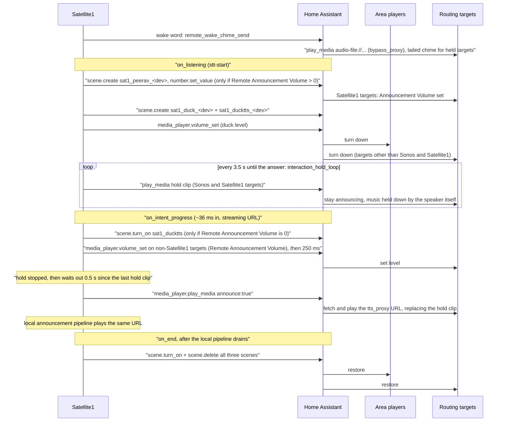

# Audio Routing and Area Ducking

Routing a Satellite1's audio - the assistant's spoken answers, the sign-in prompt, a ringing
timer, and optionally the wake chime - to other speakers, and turning down the speakers in the
same room while you talk to it.

> [!NOTE]
> **This feature was called "TTS routing", and its entities now say "Announcement".** `Announcement
> Volume`, `Remote Announcement Volume`, `Route Announcements To All Area Players` and `Remote
> Announcement Status` were `Voice Override`, `Remote TTS Volume`, `Route TTS To All Area Players`
> and `Remote TTS Status` while this branch was in development. Likewise `Remote Ducking Volume` and
> `Remote Echo Guard` were `Duck Area Volume` and `Remote Sync Guard` until October 2026, renamed so
> Home Assistant and the web app call every setting by the same name. None of them has reached
> `develop` or a release tag, so nothing is kept for compatibility and nothing needs migrating from
> those names. A device that ran the older names on this branch gets new entity ids in Home
> Assistant, orphaned old ones, and those two settings back at their defaults (`20%` and `0.2s`),
> because ESPHome keys a restored value to the entity's name. The file name, the `tts_routing:`
> package key, the internal `tts_*` globals and scripts, and the entities' internal ids
> (`duck_area_volume`, `remote_sync_guard`) keep the old words; no customer sees them.

> [!NOTE]
> **This file is temporary.** It exists so the commit that introduced these features can be
> reviewed with its reasoning attached. The customer-facing half of it will move to
> [docs.futureproofhomes.net](https://docs.futureproofhomes.net) and this file will be removed.

> [!WARNING]
> **Breaking change: this release moves the configuration into the device's web app.** The move the
> note above promised has happened, and it renames two entities and deletes three. Nothing migrates
> automatically. See [Upgrading](#upgrading) before you flash.

## Contents

- [Upgrading](#upgrading)
- [The three layers](#the-three-layers)
- [Setup](#setup)
- [Entities](#entities)
- [How a routed interaction runs](#how-a-routed-interaction-runs)
- [Design decisions](#design-decisions)
- [Rejected alternatives](#rejected-alternatives)
- [Known limits](#known-limits)
- [Troubleshooting](#troubleshooting)

## Upgrading

**Which speakers to route to, and which to duck, now live in the device's own web app** rather than in
Home Assistant. Open the device's IP in a browser and go to **Audio**. The reason is a hard limit
rather than a preference: the target list was an ESPHome `text` entity, those cap at 255 characters
because the restore saver writes the length in a single byte, and one area's worth of players needs
roughly twice that. A 292-character write returned HTTP 200 and was silently discarded.

**Your existing target list is not migrated.** It was stored in an entity that no longer exists, and
the new selection is a different shape — whole areas plus individual players plus carve-outs, rather
than one flat list. Write down your target list before flashing, then re-pick it in the app. In most
cases that is one click, because "everything in this room" is now a single tick.

### Renamed

Both keep their settings, but the `entity_id` changes, which breaks any automation, script, dashboard
card or history that referenced the old one. Fix those references, or rename the entity back in Home
Assistant under Settings > Devices & services > ESPHome > your device.

| Was | Is now |
| --- | --- |
| `Remote TTS Routing` | `Route Announcements To All Area Players` |
| `Duck Area Players` | `Duck All Area Players` |

Both also stop being independent switches and become views of the app's selection. If an automation
turns one on, it now selects this device's whole area; if it reads one, it is asking "is my whole area
selected". The ducking level is not in this table: it was new on this branch, where it is now
`Remote Ducking Volume` (see the note at the top).

### Deleted

| Entity | What replaced it |
| --- | --- |
| `Remote TTS Targets` | The Announce column of the speaker list on the app's Audio page. |
| `Remote TTS Mutes Local Voice` | This device's own Announce box in that list, **Announce on this device**, on by default — the same default as this switch being off. |
| `Duck TTS Targets` | Nothing. Routing targets are now always ducked. |

Any automation referencing one of these will fail after flashing.

### Also retired

The **`Satellite1 Do Not Duck`** label no longer does anything. Untick the player's Duck box in the
app's speaker list instead. The label can be deleted. This is the one place the change costs you something: see
[Exempting a player](#exempting-a-player).

### New capabilities

Worth knowing, because they were not possible before: ducking can now reach **any room**, not just the
device's own; a whole area can be selected such that speakers added to it later are included
automatically; and players Home Assistant has put in **no area** — which on a typical install is most
of them — are offered by name in a "No Area Assigned" group rather than having to be typed as entity
ids.

## The three layers

| Layer | File | Owns |
| --- | --- | --- |
| Gain reconciler | [`config/common/voice_assistant.yaml`](../config/common/voice_assistant.yaml), [`dac_proxy.cpp`](../esphome/components/satellite1/audio_dac/dac_proxy.cpp), [`mixer`](../esphome/components/mixer/FPH_VENDOR.md) | This device's own output level: the DAC level and the gain on each of the two mixer inputs. |
| Routing | [`config/common/tts_routing.yaml`](../config/common/tts_routing.yaml) | Sending the response to remote `media_player` entities, and everything that has to be true first. |
| Area ducking | [`config/common/area_ducking.yaml`](../config/common/area_ducking.yaml) | Other speakers' volumes: turning the room down, setting the targets' level, holding peer Satellite1s' Announcement Volume, and putting all of it back. |

They are one feature set rather than three. **Remote Announcement Volume** is declared in
`tts_routing.yaml` but carried out in `area_ducking.yaml`, because setting a remote speaker's level
needs the same snapshot-and-restore machinery ducking already had. And **Announcement Volume** is
both this device's own level for everything on its announcement pipeline and the lever another
Satellite1 routing to it pulls to set the level its replies play at here.

### The gain reconciler

Everything that sets a level calls one script, `audio_gain_reconcile`: the media player's volume,
mute and state changes, Announcement Volume, the voice pipeline, the timer, and the selection. It
is a pure function of the current state, so any trigger can run it at any time and converge on the
same answer. Nothing latches; anything that changes the answer just calls it again. It is the only
writer of the DAC level and of both mixer gains.

Music and announcements share one DAC, so the DAC sits at the louder of the two levels and each
mixer input is scaled down to its own. The scaling is a per-input gain added to the vendored
`mixer` component (`SourceSpeaker::set_gain()`, see its
[`FPH_VENDOR.md`](../esphome/components/mixer/FPH_VENDOR.md)), applied in Q31 and ramped over one
mixer block so a change does not click. Its reason to exist is that **0 is gain 0**, true silence:
the decibel ducking it replaces could only cut what the volume difference asked for and capped at
50 dB besides, so at an Announcement Volume of 50% with music at 0 the music was only about 16 dB
down.

```
music        = 0 if the media player is muted or below 0.001, else its volume
announcement = Announcement Volume if above 0, else music     # 0 is "auto"
ref          = max(music, announcement)
dac_level    = 0.1 + ref * 0.9                                # the media player's own volume remap
gain(level)  = 0 if level is 0, else 10^(-db_per_unit * (ref - level) / 20)
db_per_unit  = dac.volume_span_db() * 0.9                     # 31.5 dB on the TAS2780, 47.25 dB on the PCM5122
music gain   = gain(music), a further -20 dB while the assistant runs, an announcement plays or a timer rings
```

What that gives:

- **Announcement Volume at 0 (auto):** announcements follow the music level, both gains are unity
  and the DAC tracks the volume exactly as it always has. One volume and one mute govern the whole
  device, so volume 0 or mute silences timers and chimes too.
- **Announcement Volume above 0:** mute and volume 0 silence music only. Replies, timers, chimes,
  `tts.speak`, routed replies and the button and jack sounds keep playing at Announcement Volume.
  The volume buttons and Home Assistant's media player volume move only the music.
- **"Announce on this device" off**, with a routing target selected: a response this device
  routed elsewhere gets announcement gain 0 here. The wake chime still plays.

The cost of holding the DAC at `ref` unconditionally is that while Announcement Volume is above the
music, the music input carries the difference as a gain cut whether or not anything is speaking —
8 dB at 0.80 against music at 0.55. It is paid deliberately: an announcement this device did not
initiate arrives with no warning, and holding the DAC there is what lets it start at the right
level on its first sample. The same arrangement makes a music volume change a gain change while
Announcement Volume is the higher of the two, which is heard after about 0.6 s, the I2S and mixer
buffers in front of the DAC.

## Setup

Two things live in Home Assistant and cannot be configured or detected from the device.

**Allow the device to perform Home Assistant actions.** Both features work by asking Home Assistant
to do something, and it refuses until told to trust the device. It leaves that off for every newly
added device (`DEFAULT_NEW_CONFIG_ALLOW_ALLOW_SERVICE_CALLS` is `False` in ESPHome's config flow):

> Settings > Devices & services > **ESPHome** > your Satellite1 > **CONFIGURE** > tick
> **"Allow the device to perform Home Assistant actions"** > **Submit**

With it unticked, `async_on_service_call` logs an error, raises a repair issue and returns without
answering, so nothing on the device hears a rejection. Ticking it goes through an
`OptionsFlowWithReload`, which reconnects the device, so every check re-runs within seconds and
nothing needs reflashing.

**An area, for the two "all area players" switches.** Those two switches mean "my own room", and a
device in no area has no room to refer to, so both read off and refuse to turn on. Everything else
still works: from the web app you can route to and duck any room in the house, named or not.

> Settings > Devices & services > **ESPHome** > your Satellite1 > pencil icon > **Area** > **Update**

## Entities

### Routing

**Which speakers** is configured in the device's own web app, not in Home Assistant. Open the device
in a browser, go to **Audio**, and tick speakers in the Announce column of the speaker list. Home
Assistant keeps one switch for the common case.

| Entity | Purpose |
| --- | --- |
| **Route Announcements To All Area Players** | Switch. On sends the response to every media player in this device's area. A projection of the selection, not a value of its own — see below. |
| **Remote Announcement Volume** | The level the response and the mirrored timer ring play at on every target. Above `0` it wins on every kind of target, and each gets its own level back afterwards; `0` leaves every target's volume alone, which the app reads out as "Follow speaker volume". |
| **Remote Wake Chime** | Switch, off by default. Targets sound the wake chime when this device hears the wake word: a Satellite1 from its own flash, anything else from this device's sounds route. On Sonos and similar the chime can land up to a second late — clip playback has a fixed startup cost. |
| **Remote Timer Ring** | Switch, on by default. A ringing timer is mirrored to the routing targets until it is stopped. The selection is already the opt-in; this is the opt-out. |
| **Remote Echo Guard** | Select, default `0.2s` (options `0.2s`–`2s` in 0.2 s steps). How long the microphone stays closed after a routed response finishes locally, covering the targets' playback skew so the device cannot hear its own response echo — or its own sign-in code — off a lagging speaker. Engages only when the assistant is about to listen again. Was `Remote Sync Guard` earlier on this branch. |
| **Announcement Volume** | This device's own level for everything on its announcement pipeline: responses, received announcements, timers, chimes and button sounds. `0` follows the media volume, which the app reads out as "Follow speaker volume". |
| **Remote Announcement Status** | Diagnostic. Everything that has to be true before a response reaches a remote speaker, in one line. |

**The switch is a view of the selection, not a separate setting.** It reads on when this device's own
area is selected whole with nothing carved out of it. Turning it on selects that area; turning it off
deselects it. Untick one speaker in that room in the web app and the switch reads off — correctly,
because that is no longer the whole area. Pick a speaker in a *different* room and the response routes
there with this switch off, which the old master switch had no way to express.

There is therefore no state in which routing is "enabled" with nothing to route to. Anything chosen
means the answer is going somewhere; nothing chosen means it plays here.

**Where the response plays locally** is **Announce on this device**: the Announce box on this
device's own row of the app's speaker list, on by default. It replaced a switch called `Remote TTS
Mutes Local Voice`, which said the same thing backwards. It only affects a response that also went
elsewhere, so the app greys it out, ticked, while nothing else is ticked to Announce.

**Music Assistant duplicates are filtered out for you.** A speaker MA has adopted has two
`media_player` entities and both accept an announcement, so either appears to work. With MA ids,
playback is serialized across the targets and Sonos starts seconds late and clips the first syllable.
With native ids everything starts together and Sonos plays the response whole. The app does not offer
MA entities and whole-area expansion rejects them, so this is now hard to get wrong; the device still
checks and says so if one arrives another way. See [Rejected alternatives](#rejected-alternatives).

### Ducking

Which speakers get ducked is chosen in the web app's **Audio** page, in the Duck column of the same
speaker list the routing targets are ticked in. Home Assistant keeps the volume and one switch.

| Entity | Purpose |
| --- | --- |
| **Duck All Area Players** | Switch. On ducks every media player in this device's area. A projection of the ducking selection, exactly as its routing counterpart is — same on/off rules. |
| **Remote Ducking Volume** | The level ducked players are set to, default `20%`. Was `Duck Area Volume` earlier on this branch. |

**Remote Ducking Volume** is a target, not a reduction: every player is set to that level, so the
room lands somewhere predictable however loud it started. Players already quieter are left alone. It
is Home Assistant's `volume_level`, a 0-1 fraction each integration reads however it likes, so `20%`
is not a fixed amount of attenuation and is unrelated to the gain stage above. The app reads its `0`
out as "Mute playback".

`0%` is literal for the room — a media player at volume `0` is a muted one on many integrations,
every ESPHome speaker included, and that is the right answer for a speaker not about to speak. The
routing targets are floored at `1%` instead; see [Design decisions](#design-decisions).

**What gets ducked:** everything you have chosen in the app that is not obviously silent, reports a
volume, and is currently louder than the duck level — minus this device, and minus Music Assistant
entities. **Plus every routing target, whether you chose it here or not.** The app shows their
Duck boxes ticked and locked whenever their Announce box is ticked.

Two things are gone from that list. **Ducking is no longer confined to this device's area**: the
list offers every room in the house, so a Satellite1 in the hallway can quieten the living room. And the
routing targets are ducked unconditionally; the **Duck TTS Targets** switch that used to gate them is
deleted. That switch existed because ducking a target was only safe when the response arrived at a
level not derived from the target's standing volume, and the peer Announcement Volume hold below is
what closed the unsafe case.

How a routing target is ducked depends on what it is. A Sonos, or a Satellite1 on current firmware,
lowers its own music and is never sent a volume, even if it is also ticked here; any other speaker
is turned down to Remote Ducking Volume. A Satellite1 on older firmware is the exception: it is
ducked only if ticked to Duck, as before, and the app captions its row "Older firmware". See [Routed speakers stay ducked](#routed-speakers-stay-ducked).

"Not obviously silent" rather than "playing" because `playing` is what a player reports when it
*owns* the audio, and an amplifier does not. A Denon or Marantz receiver reports plain `on` for
every input that is not one of its own network sources, so an AVR carrying the room over HDMI never
once says `playing` while it is the loudest thing in it. The cost is that a powered-but-silent
speaker gets a volume change it did not need, and the same level back afterwards.

### Exempting a player

The one case no state test can recognise is a `media_player` that is really an amplifier: ducking an
AVR turns down everything downstream of it, so a Sonos on one of its inputs goes quiet even though
nothing touched the Sonos. Untick that player's Duck box in the app. It stays unticked when the
rest of its area is selected whole, and a speaker added to that room later is still picked up. A
routing target cannot be exempted: anything that plays the answers is ducked while they are
coming, and its ducking row is locked.

**This replaced a `Satellite1 Do Not Duck` label**, which was matched by label id and could be put on
an entity, a device or an area. The label was one setting for a whole fleet; unticking is one setting
per device. On an install with several Satellite1s that means visiting each one, and doing it again
after a factory reset. The trade was made deliberately — one source of truth for the selection, and the
web app is it — but if you have many devices and one problem amplifier, this is the part that costs
you. If you were using the label, it now does nothing and can be deleted.

## Beyond responses: the sign-in prompt, the timer ring, the chime

The selection routes four kinds of audio, not one. All of them ride the same resolved target list,
the same stop machinery and the same error reporting; what differs is where each one's audio comes
from.

**The sign-in prompt.** The web app's spoken-code sign-in speaks its prompt through
`assist_satellite.start_conversation`, whose TTS arrives over the announce path rather than a
pipeline run — it fires `on_tts_end` with the same kind of `tts_proxy` URL a response gets, and
never passes through `on_start`. An `on_tts_start` hook arms routing for it while a spoken-code
window is pending, and the URL then fans out through `tts_route_response` unchanged: same targets,
same codec swap, same watchdog, one TTS generation and one voice everywhere. The microphone only
opens on this device, so routing the prompt cannot cause several devices to capture the answer.
Deliberately scoped to the sign-in window: routing *every* announce (a `tts.speak` aimed at this
device, a doorbell clip) is a one-condition change, left unmade because an announcement someone
aimed at only this device silently following the selection would surprise its sender. The offline
challenge mode cannot route by definition — no Home Assistant connection means no action calls.

**The timer ring.** When a timer rings, `timer_remote_ring_loop` sends one announcement per ring
cycle to the whole resolved list — Satellite1 peers included, as HTTP rather than `audio-file://`,
because an HTTP announcement is what arms a peer's stop word, so "stop" spoken next to any target
works with no target-side changes. The relay closes at the origin: the **Stop Announcement** button
now also silences a ringing timer, so a target that hears "stop" (whose broadcast presses every
FutureProofHomes stop button) ends the ring *everywhere* — the loop stops re-firing, and the ring's
end fans a stop out to the non-Satellite1 targets. On Sonos the stop is the preempt clip (below):
the playing ring clip is interrupted by a ~0.4 s faint tone, so the tail is under half a second.
The clip is `timer_finished_remote.mp3`, the local ring's sound plus 2.5 s of silence (5.28 s),
longer than the loop's 3.5 s resend on purpose: each re-fire replaces a clip that is still playing,
so no target goes idle between rings. A Satellite1 keeps its music ducked and its stop word armed
for the whole ring, and a Sonos keeps its own music ducked; with the plain 2.73 s clip both lifted
their music back up between every ring.
With Remote Announcement Volume above `0`, the ring takes the same peer Announcement Volume hold
an interaction does (see [Satellite1 targets](#satellite1-targets-the-peer-hold)), so a peer rings
at this device's level and gets its own back when the ring stops.

**The wake chime**, on non-Satellite1 targets. Satellite1 peers still chime from their own flash
(`audio-file://`, no audio on the wire); everything else is sent the chime MP3 from the sounds
route below, behind the same Remote Wake Chime switch. Expectation to set: a Sonos plays a clip
0.5–1.5 s after the request and offers no preload, so the remote chime can land after listening has
already begun. The call is dispatched before the local chime plays and the file is small; that is
the best available, and it is physics, not a bug. A target the
[routed-speaker hold](#routed-speakers-stay-ducked) covers gets `wake_word_triggered_hold` instead:
the same chime followed by silence to 5.28 s, so the chime doubles as the hold's first clip.

**The remote echo guard.** Each target fetches the response URL independently, so playback skews by
0.5–2 s — and the lead device's own audio drains first, the continued-conversation microphone
reopens, and a lagging target still speaking the answer gets transcribed as a human reply (the AEC
only cancels the local speaker). The guard holds the mic shut past the skew: at `on_end` the device
enqueues an embedded 0.2 s silence clip 1–10 times (the **Remote Echo Guard** select), keeping the
announcement pipeline in `ANNOUNCING` — the one state the upstream component's listen transition,
the un-duck, the drain waits and the stop windows all gate on, so one mechanism extends them all
coherently. It also covers the sign-in hazard above: without it the device could hear its own
mirrored code off a lagging target and approve the sign-in by itself. An exact per-target
completion callback was investigated and rejected for v1: it exists for assist-satellite targets
(`VoiceAssistantAnnounceFinished`) and Music Assistant, but a Sonos AudioClip is invisible to Home
Assistant end to end, so one Sonos target forces a fixed floor regardless.

### The device serves its own sounds

The timer ring, chime, stop-clip and hold MP3s are fetched from the device itself — `GET
/api/sat1/sounds/timer_finished_remote.mp3`, `wake_word_triggered.mp3`, `stop_clip.mp3`,
`hold_silence.mp3` and `wake_word_triggered_hold.mp3`, session-gate exempt, served from the `audio_file` bytes in flash, with single-range support
because Cast refuses media whose origin cannot answer a Range request. Chosen over S3 hosting so a
mirrored timer ring works with the internet down; the cost is a topology requirement — **the
speakers must be able to reach the satellite over HTTP**. A home that VLAN-isolates them gets a
silent failure, because `play_media` reports nothing back. The check: open
`http://<device-ip>/api/sat1/sounds/timer_finished_remote.mp3` from a device on the speakers' network. If
it does not play, allow that path in the firewall. All of them are MP3 because a Sonos
AudioClip accepts MP3 and WAV only — the same codec rule the TTS swap exists for — and stereo,
because a mono clip plays center-only on a soundbar.

## How a routed interaction runs


```mermaid
sequenceDiagram
    participant Sat as Satellite1
    participant HA as Home Assistant
    participant Room as Area players
    participant Tgt as Routing targets

    Sat->>HA: wake word: remote_wake_chime_send
    HA->>Tgt: "play_media audio-file://... (bypass_proxy), tailed chime for held targets"
    Note over Sat,HA: "on_listening (stt-start)"
    Sat->>HA: "scene.create sat1_peerav_<dev>, number.set_value (only if Remote Announcement Volume > 0)"
    HA->>Tgt: Satellite1 targets: Announcement Volume set
    Sat->>HA: "scene.create sat1_duck_<dev> + sat1_ducktts_<dev>"
    Sat->>HA: media_player.volume_set (duck level)
    HA->>Room: turn down
    HA->>Tgt: turn down (targets other than Sonos and Satellite1)
    loop every 3.5 s until the answer: interaction_hold_loop
        Sat->>HA: "play_media hold clip (Sonos and Satellite1 targets)"
        HA->>Tgt: stay announcing, music held down by the speaker itself
    end
    Note over Sat,HA: "on_intent_progress (~36 ms in, streaming URL)"
    Sat->>HA: "scene.turn_on sat1_ducktts (only if Remote Announcement Volume is 0)"
    Sat->>HA: "media_player.volume_set on non-Satellite1 targets (Remote Announcement Volume), then 250 ms"
    HA->>Tgt: set level
    Note over Sat: "hold stopped, then waits out 0.5 s since the last hold clip"
    Sat->>HA: "media_player.play_media announce:true"
    HA->>Tgt: fetch and play the tts_proxy URL, replacing the hold clip
    Note over Sat: local announcement pipeline plays the same URL
    Note over Sat,HA: "on_end, after the local pipeline drains"
    Sat->>HA: "scene.turn_on + scene.delete all three scenes"
    HA->>Room: restore
    HA->>Tgt: restore
```

The order in that diagram is load-bearing in three places.

**The room is ducked at `on_listening` (`stt-start`), not `on_start` (`run-start`).** When several
Satellite1s hear one wake word, every one of them asks Home Assistant to start and every one gets
`run-start`. Only then does Home Assistant check for a duplicate wake-up — the same phrase accepted
within the last 2 s (`accept_wake_word` in `assist_pipeline`) — and it answers every request but the
first with `error duplicate_wake_up_detected` and `run-end`. Only the accepted device gets
`stt-start`. Ducking on `run-start` made the losers snapshot and duck the room as well, and their
`on_error` release then played those snapshots back: the room came up to full volume while the
winner was still listening. `stt-start` goes out in the same event-loop tick as `run-start`, so
waiting for it costs no time. "First" means the first request to reach Home Assistant, not the
first device to hear the word, and a device with **Wake sound** off asks up to 300 ms sooner than
one playing its chime, so it usually wins.

**The response is sent at `on_intent_progress`, not `on_tts_end`.** Home Assistant mints the
`tts_proxy` token before the speech exists and sends it as `tts_start_streaming`; device logs put
roughly 36 ms from intent start to that event and roughly 1.1 s to `on_tts_end`. `on_tts_end`
remains the fallback and is the only path on a TTS engine that does not stream. A global,
`tts_remote_sent`, makes the two triggers into exactly one call, and it is cleared at `on_start` so
each turn of a continued conversation gets a fresh one.

**Handing the targets their volumes back has to reach Home Assistant before the call that plays the
response.** ESPHome runs same-trigger automations in package merge order, and a package cannot
influence where it sits in that order from inside itself, so
[`config/satellite1.base.yaml`](../config/satellite1.base.yaml) declares a tiny inline package
listed ahead of `tts_routing` purely to bind `area_duck_release_tts_targets` first. It binds both
`on_intent_progress` and `on_tts_end`, since either can be the trigger that sends the response, and
the script is self-gated so being called twice hands the volumes back once.

### When the targets come back

Decided by **Remote Announcement Volume**, read once at the start of the interaction so that moving
the slider midway cannot strand a volume:

- **`0`** — restored the moment the response is ready, just before the calls that play it. Nothing
  wants them held at a level of ours.
- **above `0`** — the level they are sitting at *is* the level the response is meant to arrive at,
  so they are held through it and restored once playback has finished.

Since remote playback reports no completion, "finished" means this device's own announcement
pipeline draining: it received the same URL and drains on roughly the same schedule.

### Satellite1 targets: the peer hold

One rule covers every kind of target: **above `0`, this device's Remote Announcement Volume wins;
at `0`, each speaker plays at its own level.** Sonos reads the level off the announcement
(`extra.volume`) and anything else has its volume set, both as above. A Satellite1 reads neither —
ESPHome does not pass `extra` through — and plays every announcement at its own **Announcement
Volume**, so that is what gets set.

`peer_av_hold` in `area_ducking.yaml` does it, with two holders: the interaction (from
`area_duck_start` at `on_listening` until `area_duck_release` sees the interaction end) and the
mirrored timer ring (from `timer_remote_ring_loop` starting until `timer_remote_ring_stop`). The
first holder parks every peer target's Announcement Volume in `scene.sat1_peerav_<device>` and sets
them to Remote Announcement Volume; the last one to let go plays the scene back and deletes it. The
script is queued, so a hold and a release cannot interleave. Holding from `on_listening` rather
than with the response gives a peer playing music seconds rather than 250 ms to raise its DAC, which
is what keeps the reply from starting quiet and stepping up.

With this device as A and the peer as B:

| A's Remote Announcement Volume | B's Announcement Volume | B plays A's reply at |
| --- | --- | --- |
| `0` | `0` (auto) | B's music volume — silent if B is at 0 or muted. |
| `0` | above `0` | B's Announcement Volume, even with B's music at 0 or muted. |
| above `0` | anything | A's level, even with B's music at 0 or muted. B's Announcement Volume reads A's level from the moment A starts listening until A's interaction ends, continued conversation included, then returns to what it was. |

- **B's music** is held 20 dB down by B itself, from the moment A starts listening (from the chime,
  with Remote Wake Chime on) until A's reply on B ends — see
  [Routed speakers stay ducked](#routed-speakers-stay-ducked). A never sets B's media volume,
  whether or not B is ticked to Duck in A's speaker list. Before October 2026 A turned B's music
  down to its ducking level, and only when B was ticked to duck too.
- **The mirrored timer ring** follows the same rule: at A's level when A is above `0`, at B's own
  when A is at `0`.
- **The wake chime** on B always plays at B's own level. It goes out at the wake word, before A
  starts listening, and A cannot take the hold that early: a Satellite1 that loses a duplicate wake
  never reaches `on_listening`, and its snapshot would race the winner's.
- **An interaction and a ring share one hold.** Whichever starts first saves B's real value, and B
  gets it back only when both have ended, so a ring can never save A's level as B's "original".
- **B's own sounds during the hold** — a button sound, its own timer — play at A's level too.

**The cost is visible, and accepted.** B's Announcement Volume slider shows A's level in B's web app
and in Home Assistant for the length of the hold, and a change made there meanwhile is overwritten
by the hand-back. An invisible lever does not exist: Home Assistant reaches a Satellite1 only through
an entity, and every entity shows on the device page. An ESPHome action would stay hidden, but A
would need B's ESPHome node name to call it, and A cannot reliably work that out.

A peer is found by its entity id: the first `number` on a FutureProofHomes device whose id ends in
`_announcement_volume`, sorted so `number.<b>_announcement_volume` comes before
`number.<b>_remote_announcement_volume`. A peer without one — older firmware — is treated as an
ordinary speaker and has its media volume set instead.

### Routed speakers stay ducked

A routed speaker lowers its own music only while something is playing on it: a Sonos ducks for the
length of each clip, and a Satellite1 drops its music 20 dB while its announcement pipeline is
`ANNOUNCING`. Left at that, the music dipped for the wake chime, came back up while the person
talked and the assistant thought, and dipped again for the answer. With Remote Wake Chime off (the
default) the first dip was missing too, so the music stayed at full volume until the answer. Asking
people to tick the same speaker again to duck it was rejected, so a speaker that plays the answers
is now ducked for the whole interaction, always.

| Routing target | How it stays ducked | Its Duck box in the app |
| --- | --- | --- |
| Sonos, native or `sonos_cloud`, in any state | Held announcing by a silent clip, fetched from this device | Ticked and locked |
| Satellite1 on current firmware, while playing | Held announcing by a silent clip, played from its own flash | Ticked and locked |
| Any other speaker that takes a volume | Turned down to Remote Ducking Volume, floored at `1%` | Ticked and locked |
| Satellite1 on older firmware | Not held; turned down only if ticked to Duck, as before | An ordinary checkbox; the row says "Older firmware" |

**The hold.** From `on_listening`, `interaction_hold_loop` in `tts_routing.yaml` sends the held
targets a 5.28 s silent announcement every 3.5 s. Each clip replaces the one still playing, so the
speaker never leaves its announcement state and its own duck never lets go. Nothing sets a level,
so there is nothing to put back: if this device reboots or drops off the network, the last clip
runs out and the music returns on its own. That took 5–6 s on the bench. The timing is the timer
ring's: 1.78 s of overlap per cycle covers the roughly 1.2 s of Home Assistant and Wi-Fi lateness
measured at a peer. A shorter clip was considered and rejected. It would need a send about every
0.7 s, leave about 0.1 s of margin, and make a late hold clip cutting the answer off more likely.

**Where the clip comes from.** Peers play `audio-file://hold_silence_sound` from their own flash,
as they do the wake chime, so no audio crosses the network while this device streams the
microphone. A Sonos fetches `/api/sat1/sounds/hold_silence.mp3` from this device, with the ring's
`extra` minus its volume. It is the only way a Sonos can get a sound, so it needs the same
speaker-to-satellite HTTP as the ring (see [The device serves its own sounds](#the-device-serves-its-own-sounds)).
The clip is not pure digital silence: it opens with about 50 ms of noise at −75 dBFS, inaudible at
any volume, because a Sonos ignored a pure-silence MP3 in the field (the stop clip's finding). A
peer counts only while `playing`, because there is no music to hold on an idle one, and holding it
would cost it its own wake word for nothing. A Sonos counts in any state: a `sonos_cloud` entity's
state says nothing about the music, and a silent clip on an idle Sonos costs nothing.

**The chime.** With Remote Wake Chime on, held targets get `wake_word_triggered_hold`, the chime
followed by silence to 5.28 s, so the chime is the hold's first clip. The loop's first cycle skips
the targets that just got it, and its next send lands 3.5 s after the chime went out, inside the
tail. A peer whose own Wake sound is off still gets no chime, and is held from the first cycle.

**The hand-off.** `tts_route_response` stops the loop before it sends the answer, and if the last
hold clip went out less than 0.5 s earlier, it waits out the rest. Home Assistant can run two close
calls concurrently, and a hold clip that landed after the answer would replace it. The cost is up
to 0.5 s on about one answer in seven, and nothing when no hold was sent. The answer then replaces
the playing hold clip, and each speaker's music comes back when its answer ends.

**How it ends without an answer.** No speech, an error or a pipeline that stops: the loop stops and
the last clip runs out within 5.28 s. A timer that starts ringing mid-interaction: the loop stands
down, and with Remote Timer Ring on the ring loop, on the same timing, takes the targets over until
the ring is stopped.
The wake word said again at this device while it listens or thinks takes the usual "stop talking"
branch, which now also runs `interaction_hold_stop`: the held peers' Stop Announcement buttons are
pressed and Sonos targets get the stop clip, so the music comes straight back (about 0.3 s on the
bench). It is gated on a hold clip having gone out and no answer yet; once the answer is out,
`tts_remote_stop` owns the targets.

**Continued conversations.** The loop restarts with every turn's `on_listening`, which comes after
the remote echo guard, by which time the targets have finished the previous answer. On the bench a
peer stayed announcing from the first turn to the last, with no lift between them. A target that
lags the answer by more than the guard would have its last moment replaced by the next turn's first
hold clip; lengthen Remote Echo Guard if that happens.

**A peer's own wake word during the hold.** The peer is announcing, so its wake word takes the
"stop talking" branch: the hold clip stops there and the peer's assistant does not start. No stop
is broadcast, because the stop broadcast keys on an HTTP announcement and the hold is a flash file.
This device's next cycle holds the peer again within 3.5 s. Accepted as rare. A peer's own
non-priority sounds, such as button sounds, are skipped during the hold, as during any
announcement.

**Everyone else is volume-ducked.** While routing is active, `duck_players_jinja` in
`area_ducking.yaml` adds every routing target that is neither a Sonos nor a FutureProofHomes device
to the duck list, and takes every held target off it even if it is ticked, so nothing is ducked
twice. Those targets go through the existing targets' scene: snapshotted in `sat1_ducktts_<device>`,
turned down to Remote Ducking Volume, and handed back by the
[Remote Announcement Volume rule](#when-the-targets-come-back). A Satellite1 on older firmware
cannot play the hold clips and is left as it was: ducked if ticked to Duck, otherwise not.

**Remote Ducking Volume does not reach held targets.** They lower their music by their own amount,
20 dB on a Satellite1 and whatever a Sonos does for an announcement. The app greys the slider when
nothing ticked to Duck or Announce depends on it.

### Continued conversations

When a response ends in a question, Home Assistant keeps the conversation going and each turn is a
whole new pipeline run. The room's snapshot is not retaken and its volumes are not handed back
between turns, so the room does not jump back to full volume in the gap where you are answering.

The mechanism is `area_duck_release`'s two waits. The first waits for the announcement to drain;
the second waits up to 5 s for the assistant to leave `is_running()`, which is `state != IDLE`. A
continued conversation never passes through `IDLE`, so still running once both waits are done means
another turn is starting, and the right thing to do is nothing at all.

This was a real bug before those waits moved here: the component's trigger for a continued turn is
the media player leaving `ANNOUNCING` — the very transition the first wait ends on — so the un-duck
and the next turn came off one event and the next turn lost, hit `area_duck_start`'s re-entrancy
guard, and every turn after the first played at full volume.

The routing targets are the one thing that does move on every turn, because
`announce_targets_volume_apply` lifts them for each response and nothing else brings them down. Peer
Satellite1s do not: the interaction's hold on their Announcement Volume spans every turn and is
released once, at the end.

### Backstops

| Backstop | Covers |
| --- | --- |
| `area_duck_watchdog`, 3 min | A pipeline that never reaches `on_end` or `on_error`, including one holding peer Announcement Volumes. Sets `area_duck_force_release` so the release cannot defer again. |
| `area_duck_recover`, on reconnect | A device that rebooted mid-duck or mid-hold. The scenes live in Home Assistant, so they outlive the reset; the peer scene is played back unless a hold has been taken since. |
| The ring's own 15-minute timeout | A mirrored timer ring nobody stops. Its end releases the ring's peer hold. |
| The hold clip's own length | A device that stops sending hold clips for any reason. Nothing was set, so the last clip runs out within 5.28 s and the targets' music returns. |
| `tts_announce_watchdog` | An action call Home Assistant never answered. Waits for the local drain plus 15 s, then logs and flashes the ring. |

## Design decisions

**Home Assistant holds the volume snapshot, in a scene.** `media_player.volume_set` takes one
volume for every target, so restoring — where each player needs its own level back — has no
single-call form. A scene's `entities` dict is per-entity and Jinja can build it. Three scenes, not
one: `scene.sat1_duck_<device>` for the room, `scene.sat1_ducktts_<device>` for the targets'
media volumes and `scene.sat1_peerav_<device>` for peer Satellite1s' Announcement Volumes, because
`scene.turn_on` applies a whole scene and the three are released at different moments — the peer
scene by the last of two holders, which can outlive the interaction.

**The stored state in those scenes is `'unknown'`, on purpose.** Scene entries must carry a state
string, and a truthful one is destructive on the way back: `media_player/reproduce_state.py`
replays `turn_on` for `playing`, `paused`, `idle`, `on` and `buffering`, then `media_play`,
`media_pause` or `media_stop` to match. `'unknown'` falls through every one of those and lands only
on the `volume_level` branch, so restoring the scene issues nothing but `media_player.volume_set`.
Storing what the players were really doing would restart their queues.

**The targets' scene is the union of both features that write to a target's volume**, taken once,
up front, before anything is touched. A second `scene.create` taken later would record a level this
firmware had just written and restore the room to that.

**The device's identity travels in the payload, as a MAC.** Home Assistant renders these templates
in `async_on_service_call` with nothing but the variables the device sent, so there is no implicit
"calling device" in scope. The MAC is the handle that survives a rename: ESPHome's `manager.py`
registers the device with `connections={(CONNECTION_NETWORK_MAC, mac)}`, which the registry
normalizes to lowercase with colons.

**Remote Announcement Volume is asked for three ways, because asking once was not enough.** It
travels inside the announcement as `extra.volume`, which is the polite form — the level applies to
the response and the speaker's standing volume is never touched. In testing only Sonos read it. So
above `0` the device also snapshots the targets that read no per-call level, issues an ordinary
`media_player.volume_set`, and hands the old level back afterwards. Two kinds of target are left
out of that: **Sonos**, which already read the level, and **any Satellite1 with an Announcement
Volume entity**, which gets the peer hold instead (see
[Satellite1 targets](#satellite1-targets-the-peer-hold)). That reaches the announcement input
without touching the music one; a `volume_set` on a peer would move its *music* from the duck level
to Remote Announcement Volume ahead of the response, which was audible when an earlier build did
it. Only a peer with no Announcement Volume entity at all — an older build — still takes
`volume_set`, where it remains the one available lever.

Earlier builds let a peer's own setting win: a peer above `0` kept its level and only a peer at `0`
was set. That made the router's slider mean different things per target, so it now wins on all of
them.

The `volume_set` is sent from `tts_route_response`, immediately ahead of the `play_media` call, and
the response is held back a further 250 ms whenever the slider is set. Ordering is not the worry —
Home Assistant dispatches calls in the order the connection delivers them — but dispatch is not
application: a networked speaker takes a round trip to accept a volume, and a response that starts
at the old level and jumps partway through is exactly what this prevents. It used to fire at
`on_intent_start`, a whole trigger earlier, and a music-playing generic target then sat at the
response's level for all of intent processing and TTS generation; firing with the response shrinks
that window to the 250 ms plus the target's own fetch-and-buffer time.

**A Satellite1 plays everything on its announcement pipeline at its own Announcement Volume.** No
per-call volume can reach the firmware, so `audio_gain_reconcile` applies one level to the whole
announcement input: a voice reply, a `tts.speak`, a doorbell clip sent with `announce: true`, a
Music Assistant announcement, a response another Satellite1 routed here, and the timer ring, wake
chime and button sounds. The chimes used to be excluded so that raising the level could not make
the wake sound startling; they are included now because a user who sets Announcement Volume and
mutes the music expects the timer to still ring, and an excluded chime would have followed the
muted music into silence. To make routed responses louder on a Satellite1, raise the *router's*
Remote Announcement Volume, or with that at `0`, the *target's* Announcement Volume.

**Targets turned down by volume are floored at `1%`, whatever Remote Ducking Volume says.** `volume_level` `0`
does not mean "very quiet" to a media player, it means mute — ESPHome's
`SpeakerSourceMediaPlayer::set_volume_()` ends in `set_mute_state_(true)` under 0.001. On a
Satellite1 in auto mode (Announcement Volume `0`) a muted media player silences the announcement
input too, so a `0%` duck would take the answer with it. `1%` keeps the player unmuted and is
still close to inaudible under a reply.

**Music Assistant entities are excluded from the area walk so every speaker is ducked exactly
once.** A speaker MA has adopted appears in the area twice, and ducking both means ducking the same
speaker twice — which was worse than untidy, because sparing works on entity ids: a target
deliberately spared was turned down through its mirror anyway. It could also turn down the
Satellite1's own speaker, the one about to deliver the response. The native entity is kept, since
it is the id the original integration owns and the one the target list is documented to hold.

**Routing switches the announcement codec to MP3, and back to FLAC when off.** Sonos plays an
announcement as an AudioClip over its websocket API, and that accepts MP3 and WAV only
(`ANNOUNCE_AUDIOCLIP_SUPPORTED_FORMATS`). Hand it a FLAC URL and the clip is submitted anyway, the
speaker answers success, and no sound comes out — no error reaches Home Assistant, let alone the
device. The codec is the device's to pick: Home Assistant reads the announcement format off
`ListEntities` and passes it to the TTS engine as `ATTR_PREFERRED_FORMAT`, so it decides the
extension on the one URL every target is given. FLAC is the cheaper decode and stays the default
for a device playing its own responses; MP3 is only paid for while a response is on its way
elsewhere.

`ListEntities` is sent once per connection, so a format changed at runtime is invisible until the
next one. The device asks for that reconnect with `homeassistant.reload_config_entry` — the same
thing ticking the actions checkbox does — which costs a few seconds of unavailability. It is only
asked for when the codec actually changes, and a device that boots with routing already configured
never reloads at all, because `tts_announce_format_apply` runs at `on_boot` priority `-100` before
anything connects.

**The travelling MP3s are stereo; the local FLAC stays mono.** A mono clip lands on a Sonos
soundbar's center channel only and sounds thin; stereo renders across the bar. So the MP3
announcement format advertises `num_channels = 2` (Home Assistant transcodes the TTS to stereo)
and the served sounds — the timer ring, the wake chime and the stop clip — are encoded stereo,
which costs about 2% extra flash at the same bitrate. The device's own announcement pipeline is
configured mono, but that only shapes the advertised default: the decode chain carries a file's
own channel count and the mixer maps it onto its 2-channel output, so stereo responses play
locally unchanged. What stereo cannot do is reach bonded **surrounds** — see Known limits.

**"Stop" reaches a playing Sonos announcement by preempting it with a new clip.** A playing
AudioClip cannot be cancelled through Home Assistant — `cancelAudioClip` exists but is LAN-only,
needs the clip id, and nothing retains one — but the clip priority system is the lever: clips are
LOW priority by default and a LOW clip interrupts a playing LOW clip at any time. So the stop
fan-outs (`tts_remote_stop`, `timer_remote_ring_stop`) send Sonos targets one more announcement,
`stop_clip.mp3` — ~0.4 s of a faint fading tone, served from the device like the ring and chime —
and the response's tail shrinks from the rest of the answer to roughly the clip startup latency.
The clip is deliberately not digital silence: a field-tested pure-silence MP3 failed to register
as a clip at all. It reads as a soft acknowledgment that the stop was heard.

**`play_on_bonded: true` travels in `extra` on every routed announcement.** Read by exactly one
integration — the [`sonos_cloud`](https://github.com/jjlawren/sonos_cloud) custom one, where it
fans the clip out to every speaker bonded into the room, which is the only path to Sonos
surrounds (see Known limits). Everyone else ignores unknown `extra` keys, the same reasoning
`use_pre_announce: false` rides on. The app's speaker list offers `sonos_cloud` entities for explicit
selection, but whole-area expansion rejects them exactly as it rejects Music Assistant ids: the
integration duplicates every Sonos, and a whole-area pick would announce through both twins.

**The device probes the actions checkbox rather than waiting to be noticed.** `ha_action_probe`
fires one harmless `persistent_notification.dismiss` for an id nothing ever creates, five seconds
after Home Assistant connects, and reads the answer off whether one comes back at all — with the
box unticked, neither `on_success` nor `on_error` fires, and that silence is the entire signal
available. Firing the call is also what surfaces the problem *inside* Home Assistant, since the
repair issue it raises for a rejected call already carries the fix. Gated on routing being on, so a
device that never uses the feature never trips that card.

Home Assistant has only answered action calls since **2025.12**. Before that an allowed call and a
rejected one are identical from the device, so the check is skipped rather than guessed:
`ha_supports_action_replies` is parsed out of the client info string on connect, and
`ha_actions_allowed` lands on `3` (unverifiable) instead of `2` (blocked). The same flag arms
`tts_announce_watchdog`, which would otherwise flash red after every response on an older install.

**The remote wake chime sends a URI, not audio.** `audio-file://wake_word_triggered_sound` is
resolved by the target against its own flash: `async_process_play_media_url` returns early for any
scheme that is not http or https, and on the far side `SpeakerSourceMediaPlayer::control()` picks
its source by asking each one `can_handle()`, which `AudioFileMediaSource` answers for that scheme.
So a few dozen bytes cross the network, the target plays the same file at the same level its own
wake word would have, and **targets need no firmware update and gain no new entity** — only the
device making the call is reflashed.

`bypass_proxy: true` is not decoration. Home Assistant substitutes an ffmpeg proxy URL for any
media id its `_is_url()` accepts on any device advertising supported formats, and `_is_url` is no
more than "urlparse found a scheme and a netloc", which this URI satisfies. ffmpeg cannot open it,
so without the flag the call succeeds, the log stays clean, and no chime is ever heard.

Three things decide whether a target chimes, all checked per target per wake word: it has to be a
Satellite1, its own **Wake sound** switch has to be on, and routing has to be configured. A target
whose switch cannot be found is treated as off, because a chime nobody asked for is worse than one
that never came.
This device's own **Wake sound** is not one of the three; it governs this device's speaker alone.

**A Satellite1 is recognised by manufacturer, not integration.** Every ESPHome device shares the
`esphome` integration, so `integration_entities` cannot separate them. Home Assistant derives the
registry's manufacturer and model by splitting the ESPHome project name on the first `.`, and this
project is `FutureProofHomes.Satellite1`.

**`DACProxy` has one owner, the reconciler.** Two independent writers used to reach the component
on every media volume change, in an order neither controls: the speaker chain defers its I2C work
to `I2SAudioSpeaker::loop()`, while the media player's `on_volume` automation runs before that loop
iteration, so whichever wrote last won. The chain's `set_volume()`, `set_mute_on()` and
`set_mute_off()` are now no-ops that report success, and the reconciler drives the DAC through
`set_level()` alone. Mute is no longer a hardware state at all: music and announcements share one
output, so a hardware mute on line out (where the PCM5122's mute register does hold) silenced
announcements along with the music. Mute and volume 0 become a music gain of 0 instead, which is
why `on_mute` and `on_unmute` run the reconciler.

Two hardware bugs went with it. `TAS2780::set_volume()` wrote the DVC register whether or not the
chip was muted, replacing the mute code `0xC9` with about -31.5 dB, so volume 0 on the built-in
speaker played at roughly the level of 5%; it now records the level while muted and
`set_mute_off()` writes it. And activation no longer gates unmute on the persisted `*_is_muted`
flags: a unit saved at volume 0 had them set, nothing would ever have cleared them, and it would
have booted muted. The level is persisted to both output slots, and the mute flags are written as
false; `DACProxyRestoreState` keeps its layout, so the saved output selection still loads.

**Raising the DAC is deferred 800 ms, and only when it has to be; lowering is immediate.** Lowering
just plays already-buffered audio a little quieter than intended. Raising while an input with audio
playing or buffered is having its gain cut has to wait for that cut to reach the samples already in
flight, and `i2s_audio_speaker` defaults to `buffer_duration: 500ms` on top of the mixer's 100 ms.
The delay lives in its own script, `audio_gain_raise`, so a burst of volume events re-arms it
instead of discarding a raise the reconciler already committed to. In every other case the DAC
moves at once — in auto mode both gains are unity and nothing is cut, so the volume buttons respond
exactly as they always have, and an announcement this device did not start does not play its first
800 ms at the old level and jump.

## Rejected alternatives

**A three-option routing dropdown, with a "TTS Synced" mode.** It built a Music Assistant group and
played the response through it as ordinary media so it travelled MA's sample-synchronized stream.
Measured against the announcement path it lost on every count: a noticeable delay before the first
word while MA established clock sync, music that never resumed because the response took over the
queue, a requirement for Music Assistant entity ids, and a standing volume change on every target
the firmware had no way to undo. Sample-accurate speech across a group is not worth any of those,
so the mode is gone and routing is a plain on/off choice per speaker.

> [!IMPORTANT]
> The target field has been through two moves. It was `text.<device>_tts_target_media_player`, then
> `text.<device>_remote_tts_targets`, and it is now not an entity at all — see
> [Upgrading](#upgrading). Home Assistant derives an ESPHome entity's id from its name, so each move
> orphaned the previous entity rather than renaming it in place.

**Two calls, split by integration.** The response used to go out as one
`media_player.play_media` for native entities and one `music_assistant.play_announcement` for MA
ones, on the belief that an MA entity could only be reached through the latter. That was wrong: MA
registers `play_announcement` against `_async_handle_play_announcement`, and its `async_play_media`
calls that same method whenever `announce` is true, reading `use_pre_announce`, `pre_announce_url`
and `announce_volume` out of `extra`. The two actions are one code path under two names. Testing
agreed — holding the entity ids fixed and changing only the action changed nothing, while holding
the action fixed and changing the ids fixed everything. The ids were the variable; the action never
was. It is one call now.

**Sending `announce_volume` to anybody.** Keeping that key away from Squeezebox targets was the
two-call split's last justification: native Squeezebox reads it as a `0.0`-`1.0` float and rejects
the call outright above `1`, so every level above 1% dropped the response entirely for those
targets. Only Sonos ever honoured a per-call level and it reads `extra.volume`, which is still
sent, so the key now goes to nobody and the hazard is gone by construction rather than by sorting.
`use_pre_announce: false` travels alongside, to suppress Music Assistant's bell chime without
anyone having to uncheck it per player.

**Reaching a Satellite1 target through Music Assistant to get a per-call level to it.** MA sees one
as a sendspin player and relays announcements back out through the device's own ESPHome entity,
which carries the URL and `announce: true` and nothing else — `providers/sendspin/player.py` logs
"Ignoring announcement volume level for player" on the way past. The controller does not apply it
on the provider's behalf either, on the assumption that a player owning its volume can apply the
level itself, and the four `announce_volume` options are hidden in that player's MA settings for
the same reason. Where MA does honour a level it also clamps it to `announce_volume_min` /
`announce_volume_max`, defaults **15** and **75**. The `volume_set` reaches those targets instead.

**Routing a Sonos through its Music Assistant entity to sidestep the codec question.** MA
re-streams the audio rather than handing the speaker a URL to fetch, so FLAC would work. Do not:
the staggered start and clipped first syllable cost more than the problem it solves, and the MP3
swap already handles the codec.

**WAV as the third announcement codec.** Home Assistant streams WAV responses over the API in-band
and never mints a URL, which would leave nothing to route.

**Targeting `reload_config_entry` by device.** It accepts a device target, but that warns
"Reloading a config entry by target is deprecated" on every call and stops working in Home
Assistant 2027.4, so the device resolves its own `entry_id` instead.

**Ducking the local speaker in the area walk.** It is already handled by the reconciler's music
gain. Ducking it here as well would fight that.

**Volume-ducking routed Sonos and Satellite1 speakers like everything else.** It would have needed
no new mechanism, but every one of them already lowers its own music for an announcement, and a
volume duck on top meant a snapshot, a level change and a hand-back per interaction. Holding them
announcing touches no level at all, so there is nothing to restore and nothing to strand if this
device disappears.

**An opt-out for ducking routed speakers.** A speaker that plays the answers and keeps its music up
while they are coming is the bug this fixed, not a preference anyone asked to keep.

**A "Timer Ringing" sensor on every Satellite1**, so a router could tell when a peer's own timer was
ringing and leave it alone. Rejected as a new entity on every device for a rare case; the fix
belongs on the peer, so that its own ring always wins (see Known limits).

**Muting the local speaker on every routed response.** Earlier firmware did, with no way to ask for
anything else. A routed response now plays **here as well as there**, because in a room with more
than one Satellite1 that is the only behavior that makes sense: which one hears the wake word first
is luck, and whichever it is, the room should answer. Unticking **Announce on this device** turns
the local half off, for a device whose job is only to listen.

> [!IMPORTANT]
> This reversed the old behavior and the change arrived silently. A Satellite1 routing to a speaker in
> the same room needs **Announce on this device** unticked.

That choice is carried out in `audio_gain_reconcile`, not at `on_start`, and not by stopping the
pipeline: the local announcement input's gain is set to 0 instead. Everything else about the
interaction is then identical either way — the local pipeline receives the same URL and drains on
the same schedule, which is what `on_end` and both watchdogs wait for. Silencing at `on_start`
instead used to cut the wake chime off mid-sound, since it shares the announcement pipeline.

## Known limits

- **The room un-ducks when this device's audio drains**, which with routing on is earlier than the
  routed response finishes playing elsewhere.
- **Cast declares no announcement support**, so on a Chromecast, Nest speaker or Cast group the
  response replaces what was playing and nothing resumes afterwards.
- **A player that exists only inside Music Assistant is never ducked** — a Snapcast or Slimproto
  player has no native entity to duck instead. Those are also the one case where an MA id in the
  target list is unavoidable, and the check will flag it anyway.
- **A target whose Wake sound or Announcement Volume entity has been renamed in Home Assistant**
  drops out of the corresponding lookup: the chime is treated as off, and the peer is treated as an
  ordinary speaker whose media volume is set instead of its Announcement Volume.
- **A peer's Announcement Volume shows the router's level during a hold**, in its web app and in
  Home Assistant, and a change made there meanwhile is overwritten when the hold ends. See
  [Satellite1 targets](#satellite1-targets-the-peer-hold) for why there is no invisible lever.
- **The wake chime on a peer plays at the peer's own level**, so with Remote Announcement Volume
  above `0` the chime and the reply that follows it can differ.
- **Home Assistant reports a missing action or invalid data, but not an entity it could not find**,
  so a misspelled target is silently nothing rather than an error. Only `ServiceNotFound`,
  `ServiceValidationError` and `vol.Invalid` are answered at all; anything else, `HomeAssistantError`
  included, is logged on Home Assistant's side and never sent back.
- **A target already speaking a routed response has it cut short by a remote wake chime**, though
  saying the wake word again during a response is handled as "stop talking" before any chime is
  considered.
- **When several Satellite1s hear one wake word, each sends its remote wake chime**, so a peer
  can play two overlapping chimes. The chime goes out the moment the wake word is detected, before
  Home Assistant has picked which device answers; only the accepted one ducks and listens. Waiting
  for that verdict would delay every remote chime by roughly 0.3–0.5 s, which is the worse trade.
- **Labels need Home Assistant 2024.4**; the actions-checkbox verification needs **2025.12**.
- **The remote echo guard adds its own length to every follow-up turn** while routing is active —
  the price of never hearing your own answer. Shorten the select if the pause grates and the
  targets are fast.
- **A Sonos bonded set plays announcements on its primary speaker only.** A home-theater room
  announces through the soundbar and a stereo pair through its left speaker; surrounds and subs
  never receive the clip. This is the AudioClip API — it targets exactly one player, there is no
  group form, and no encoding works around it. The escape hatch for surrounds is the
  [`sonos_cloud`](https://github.com/jjlawren/sonos_cloud) custom integration, **verified working
  September 2026**: install it via HACS *alongside* the native integration (never instead — ducking,
  volume snapshots and the stop machinery all need the native entities), rename its duplicate
  devices so the two sets are tellable apart, and tick the cloud `media_player` to Announce in the
  app's speaker list with the native twin unticked. The firmware's calls already carry `play_on_bonded: true`, and the
  response plays through the soundbar and every surround — via near-simultaneous per-player calls,
  close but not sample-locked. Its costs: a Sonos developer account and OAuth (it is cloud-based,
  so those announcements need the internet). Its README asks for publicly reachable clip URLs, but
  in practice the speaker fetches the URL itself — the LAN `tts_proxy` URL played fine on the
  verifying install; if a cloud entity stays silent while the native one works, URL reachability
  is the first suspect and Nabu Casa remote URLs the fallback.
- **A stopped Sonos announcement ends with a soft ~0.4 s tone** — the preempt clip is the only
  way to interrupt a playing AudioClip, and it must carry real audio to register, so "stop" on a
  Sonos is followed by a faint fading blip rather than instant silence.
- **Device-served sounds need speaker-to-satellite HTTP.** A VLAN that blocks it silences the
  remote ring and chime with no error anywhere; see the check above.
- **The sign-in prompt is not ducked on the targets** — the ducking snapshot rides the pipeline's
  `on_listening`, which the announce path never fires. The prompt plays at each target's standing
  volume, plus `extra.volume` on Sonos.
- **A peer's own ringing timer can be replaced by something this device sends.** The peer's local
  ring repeats on its announcement pipeline, so a hold clip, a routed answer or a remote chime sent
  while it rings replaces the ring sound, and that sound then repeats. This device cannot see a
  peer's timer, or a conversation the peer starts during this device's, and keeps holding a playing
  peer through either. Answers and chimes did this already; the hold makes it more likely. To be
  fixed on the peer's side so its own ring always wins, which needs the peer to know what its
  announcement pipeline is playing.
- **A Satellite1 on older firmware is not held.** It does not have the hold clips in flash, so it
  keeps the old behaviour — music up between the chime and the answer unless it is ticked to Duck —
  until it is updated.
- **Held speakers ignore Remote Ducking Volume.** A routed Sonos or Satellite1 lowers its music by its
  own announcement duck, which this device cannot set.

## Troubleshooting

**Remote Announcement Status** is the first place to look. Its states, in the order they are tested:

| State | Meaning |
| --- | --- |
| `Off (local playback)` | Routing is off. Nothing is routed and no calls are made. |
| `Blocked: allow HA actions in device settings` | The checkbox is unticked. Nothing can be routed. |
| `No targets set` | Routing is on, but the target list is empty or still reading its hint. |
| `Music Assistant ids in targets` | At least one target is a Music Assistant entity. |
| `Cannot verify: Home Assistant older than 2025.12` | Configured, on a Home Assistant that cannot confirm the checkbox either way. |
| `Ready: 2 targets` | Configured and confirmed, with the parsed target count. |

The Music Assistant verdict comes from `announce_targets_ma_check`, which asks
`music_assistant.get_queue` about the target list. It is `SupportsResponse.ONLY` and only reads, so
aiming it at the targets changes nothing, and the answer is in whether one comes back: a target MA
owns produces a response keyed by entity id, a list it owns none of raises `HomeAssistantError`,
and an install without MA raises `ServiceNotFound`. Both failures are the correct configuration,
which is why *success* is the branch that complains.

**Log tags.** `tts_routing` for routing and the probe, `area_ducking` for volumes and scenes,
`audio_gain` for the reconciler. The last prints the whole resolved gain state, which is the
quickest way to confirm a level took effect:

```
[D][audio_gain]: music 0.55, announcement 0.80 (setting 0.80), ref 0.80 -> music gain 0.404, announcement gain 1.000, DAC 0.82 (now 0.82)
```

`, raise deferred` on the end of that line means a gain cut is still reaching the buffered audio and
the DAC will catch up within 800 ms. `area_ducking` logs `holding peer Announcement Volume at 40%
(interaction)` when it takes the peer hold and `handing peer Announcement Volume back (ring)` when
the last holder lets go. The routed-speaker hold logs nothing per cycle — it repeats every 3.5 s —
but `tts_routing` logs `stopping the routed-speaker hold` when "stop" ends it early. If a routed
speaker's music comes back up before the answer, check that a Sonos can fetch
`/api/sat1/sounds/hold_silence.mp3` from this device, and that a peer is on current firmware.

**Every routed response logs the exact call it is about to make**, resolved on the device rather
than left in template form, so it can be pasted into Developer Tools > Actions as-is. Running it by
hand is the fastest way to tell whether a silent speaker is the Satellite1's problem or the
target's:

```
[D][tts_routing]: routing response: volume 40%, codec mp3
[D][tts_routing]: action: media_player.play_media
[D][tts_routing]: data:
[D][tts_routing]:   entity_id: ['media_player.kitchen', 'media_player.office']
[D][tts_routing]:   media_content_id: http://192.168.1.10:8123/api/tts_proxy/JXdWXObgLZYystkXU2XZ3Q.mp3
[D][tts_routing]:   media_content_type: music
[D][tts_routing]:   announce: true
[D][tts_routing]:   extra: {'use_pre_announce': false, 'volume': 40}
```

A response that fell back to the late path says so, which means the TTS engine does not stream:

```
[D][tts_routing]: no streaming TTS URL for this response; routing it at tts-end
```

**The three scenes are the record of what the device decided to touch.** While an interaction is
running, each one's `entity_id` attribute lists exactly which players or numbers were snapshotted,
which is the quickest way to see why a speaker was or was not included.

**Failed calls flash the LED ring red**, five fast pulses — the same warning the mute switch uses
when Home Assistant refuses it. The remote wake chime deliberately does not: red means the customer
asked a question and the answer went nowhere, and spending it on an acknowledgement sound would
make it mean less.
